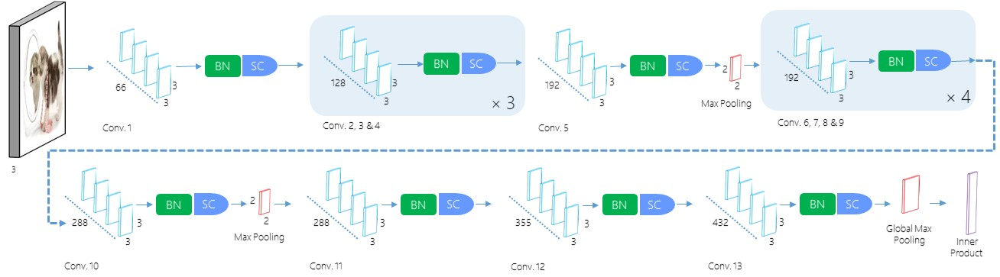

# Proyek Akhir : Image Classification Model Deployment (Dicoding Belajar Pengembangan Machine Learning - 2023) ✨

Submission for Dicoding's Belajar Pengembangan Machine Learning. Implemented <a href = 'https://github.com/Coderx7/SimpNet'>Simpnet</a> as an architecture to be trained with the CIFAR10 Dataset
## Simpnet Architecture


## Setup environment
```
conda create --name main-ds python=3.9
conda activate main-ds
pip install numpy pandas plotly matplotlib seaborn jupyter re nltk string wordcloud tensorflow sklearn PIL visualkeras
jupyter notebook
```
